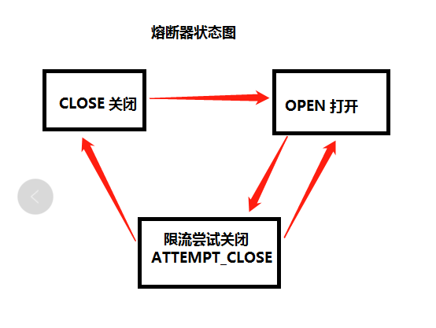

# CircuitBreaker 本地熔断器
### 如果要做成分布式的则存储可用redis

### 该熔断器基本原理
- 熔断器CircuitBreaker内部聚合两个对象，CbState:是对熔断器状态的抽象  CbStrategy:熔断器实行的不同熔断策略的抽象类

- CbStrategy 有两个实现类 FailContinuousCbStrategy：连续失败熔断策略  FailSumCbStrategy：阈值内失败次数熔断策略；

###熔断器状态解释
- CLOSE 关闭状态 ：也是初始状态，CLOSE状态下允许所有Callable保护代码块的调用，当失败超过不同策略的阀值，转入OPEN状态，

- OPEN  打开状态 ：熔断状态下只能降级执行应急计划Fallback，当OPEN状态打开时间超过阈值，则转入ATTEMPT_CLOSE限流恢复状态。

- ATTEMPT_CLOSE 尝试关闭状态 ：尝试关闭状态下会限流3个请求通过尝试调用Callable保护代码块，探测失败模块恢复与否。
              如果连续3次探测都成功 则转入CLOSE状态 ，如果连续3次探测有失败的情况 则转入OPEN状态。
              
